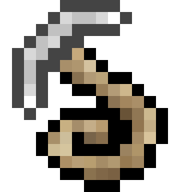

# Grappling Hook Fabric Mod for Minecraft

A mod which adds grappling hooks. The aim of this mod is to provide a fun way to get around large builds like cities.

This mod is for Fabric only. (for [Forge (Original)](https://github.com/yyon/grapplemod))

1.18.2 versions requires Cloth Config API:  https://www.curseforge.com/minecraft/mc-mods/cloth-config-fabric

## Mod Description (Original)

[https://www.curseforge.com/minecraft/mc-mods/grappling-hook-mod](https://www.curseforge.com/minecraft/mc-mods/grappling-hook-mod)

## Project Structure

Currently, the versions of this mod for Minecraft 1.18.2.

### Code Structure Overview

- `main/java/com/yyon/grapplinghook/client`: Client-side code. Initialization in `ClientSetup.java` and event handlers in `client/*Event.java`, `*Mixin.java`. All non-client-side code must call `ClientProxy.java` code through `ClientProxyInterface.java`.
- `main/java/com/yyon/grapplinghook/common`: Code that runs on both client-side and server-side. Initializiation in `CommonSetup.java` and event handlers in `server/*Event.java`, `Server*Mixin.java`.
- `main/java/com/yyon/grapplinghook/server`: Server-side code. 
- `main/java/com/yyon/grapplinghook/blocks`: All Minecraft blocks added by this mod.
- `main/java/com/yyon/grapplinghook/items`: All Minecraft items added by this mod.
- `main/java/com/yyon/grapplinghook/entities`: All Minecraft entities added by this mod.
- `main/java/com/yyon/grapplinghook/enchantments`: All Minecraft enchantments added by this mod.
- `main/java/com/yyon/grapplinghook/controllers`: Code for physics / controlling player movement while on a grappling hook, etc.
- `main/java/com/yyon/grapplinghook/network`: Custom network packets which are sent between client and server
- `main/java/com/yyon/grapplinghook/config`: Configuration parameters provided by this mod that allows users to configure the parameters through a config file or cloth config
- `main/java/com/yyon/grapplinghook/integrations`: Integration of this mod with other mods
- `main/java/com/yyon/grapplinghook/utils`: Miscellaneous utilities

## TODO

 * not works correctly
   * about key bindings (`NonConflictingKeyBinding`)
   * tooltip CR, LF
 * test survival mode
   * recipe
   * enchantment
